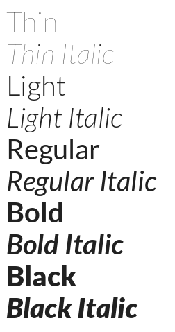

# LOCAL GOOGLE FONTS


Visit [Google Fonts for more](https://fonts.google.com)

Use google fonts locally for various frontend development projects.   
A good package to use in your electronJS and other native html/javascript projects.

## Instructions

* Place the fonts.css in your project's css directory.

```bash 
cp css/fonts.css 'YOUR-PROJECT-CSS-FOLDER'
```
* Make a folder webfonts in your Project's directory at the same place where you have the 'css' directory
(Preferebly put all the static stuff in 'assets' directory).

```bash
cd 'YOUR-PROJECT-DIRECTORY'/assets
mkdir webfonts
```

* Download the required google font and the customisations, extract to folder and place them in webfonts directory. (Make sure to do 'extract to folder', simply extracting and copying wont work).

* Include the ```fonts.css``` in your html file, above your custom stylesheet.
```html
    <html>
        <head>
            .
            .

            <link rel="stylesheet" href="assets/css/fonts.css">
            <link rel="stylesheet" href="assets/css/style.css">
            <link rel="stylesheet" href="assets/css/custom.css">
            .
            .
        </head>
        <body>
            .
            .
        </body>
    </html>
```

* In your `index.html` file use the google font as instructed on fonts.google.com, below are few examples.
```html
<p class="f11-thin">I'm a thing text</p>
<p class="f11-thin-italic">Im a thing italic text</p>
<p class="f11-regular">I'm a regular text</p>
<p class="f11-bold">I'm a bold text</p>
<p class="f11-bold-italic">I'm a bold italic text</p>
<p class="f11-black">I'm a black text</p>
<p class="f11-black-italic">I'm a black italic text</p>
```

## Project Folder Structure

```bash
Local-Google-Fonts/
├── assets
│   ├── css
│   │   ├── custom.css
│   │   ├── fonts.css
│   │   └── style.css
│   └── webfonts
│       └── Font
│           ├── Font-BlackItalic.ttf
│           ├── Font-Black.ttf
│           ├── Font-BoldItalic.ttf
│           ├── Font-Bold.ttf
│           ├── Font-Italic.ttf
│           ├── Font-LightItalic.ttf
│           ├── Font-Light.ttf
│           ├── Font-Regular.ttf
│           ├── Font-ThinItalic.ttf
│           └── Font-Thin.ttf
├── index.html
├── LICENSE
├── README.md
└── screenshots
    ├── Screenshot_2019-10-13 Google Fonts.png
    └── template.png
```

## List of available fonts
---
#### Abrial fatface (f1)
---
#### Armata (f2)
---
#### Hind (f3)
---
#### Libre-Baskerville (f4)
---
#### Lusitana (f5)
---
#### Montserrat (f6)
---
#### Nunito (f7)
---
#### Open-Sans (f8)
---
#### Roboto (f9)
---
#### Source-Sans-Pro (f10)
---
#### Lato (f11)

  

---
#### Open Sans Condensed (f12)
---

## Guide to contributing

To contribute follow the following [Contribution Guide](CONTRIB.md).

## Support this Project
* Feel free to add new google gonts to the project.
* Good starting point for newbies in open source.
* Accepting Hacktober fest PR's.

## License
Copyright © 2019, [Md Azmal](https://github.com/md-azmal).
Released under the [MIT License](LICENSE).
